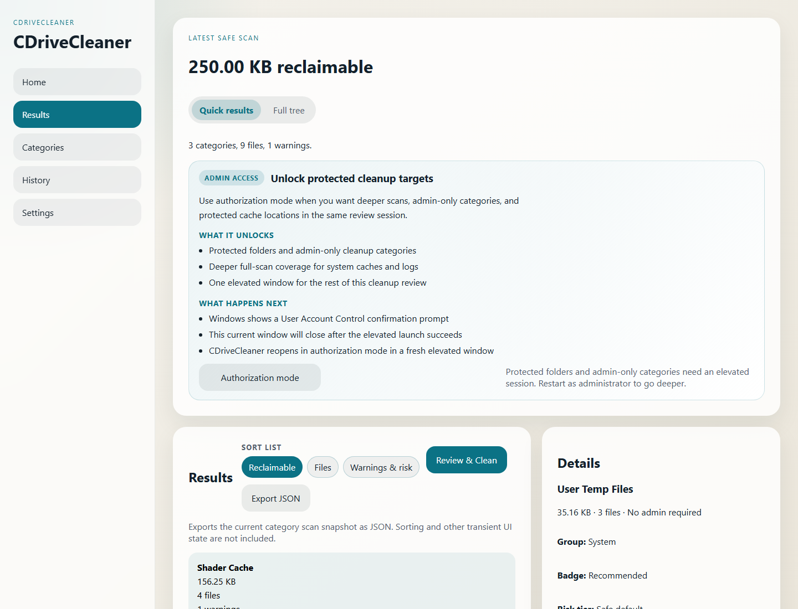
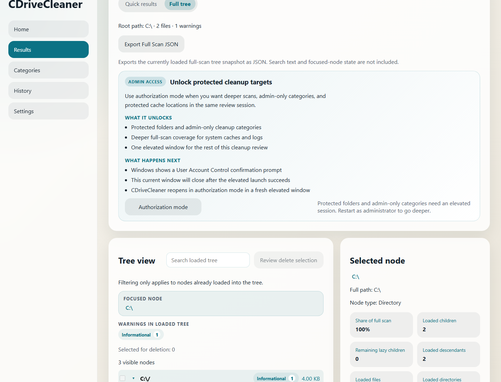
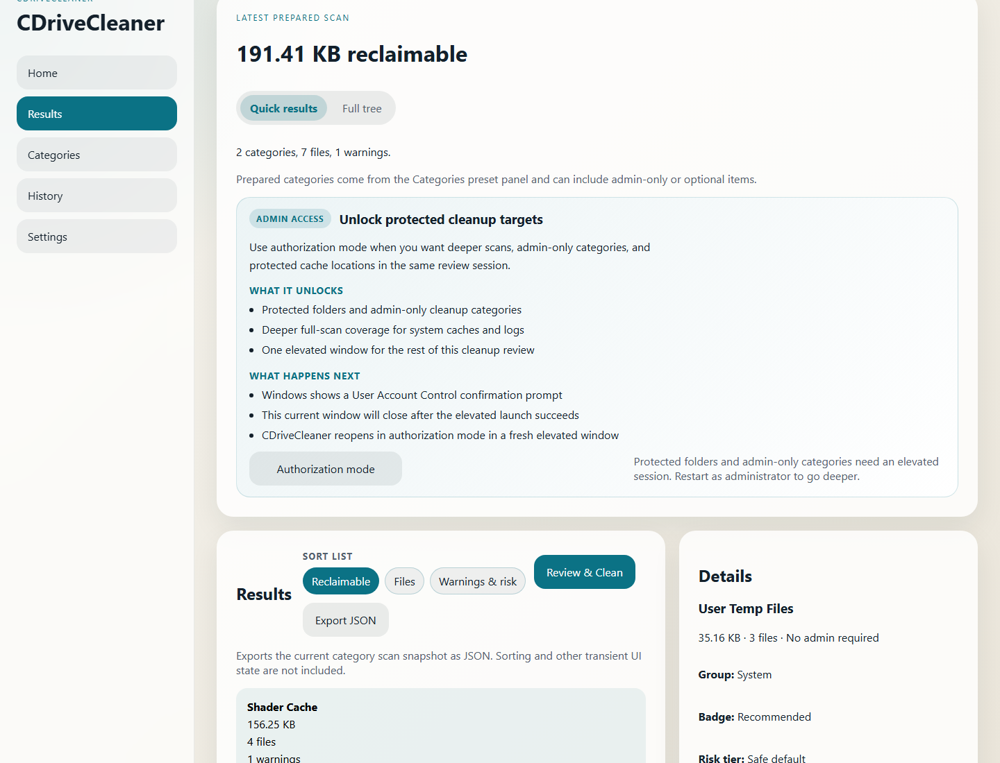

# CDriveCleaner

English | [简体中文](./README.zh-CN.md)

`CDriveCleaner` is a Windows-focused disk cleanup and full-scan analysis desktop app built with Rust, Tauri, and React.

## Why this project exists

Windows cleanup tools often trade clarity for speed: they either hide what will be removed, or make it hard to inspect disk usage before taking action.

`CDriveCleaner` focuses on a safer workflow:

- inspect first
- understand what is large or reclaimable
- clean with bounded, explainable actions
- keep performance measurable as scan trees grow

## Project status

- Current stage: active rewrite / pre-release hardening
- Primary target: Windows desktop workflows
- Main priorities: safe cleanup flows, explainable full-scan results, and measurable performance improvements on large trees

This repository already contains a usable desktop application, a shared Rust cleanup engine, regression tooling, and stress benchmarks. It is being prepared for a future public open-source release.

## Preview

- Today, the fastest way to preview the app is to run `pnpm --filter desktop tauri:dev` or build a portable executable with `pnpm --filter desktop tauri:build:portable`.

### Screenshots

#### Home / quick actions



#### Results / full-scan tree review



#### Prepared cleanup workflow



## Installation and evaluation

There is no signed public installer yet.

Current evaluation paths:

1. Run from source with `pnpm --filter desktop tauri:dev`
2. Build a portable executable with `pnpm --filter desktop tauri:build:portable`
3. Run the verification chain first if you want confidence before local evaluation:

```powershell
pnpm qa:full-regression
```

### Current prerequisites

- Windows environment
- Rust stable toolchain (current local baseline: `stable-x86_64-pc-windows-gnullvm`)
- Node.js with pnpm support
- WebView2 runtime available on the target machine for desktop execution
- For portable builds: an `llvm-mingw` distribution on disk with `LLVM_MINGW_BIN` pointing at its `bin` directory (used to stage `libunwind.dll` / `libwinpthread-1.dll`).

### Local data directory

- Runtime history, exports, and scheduled-scan metadata now live under `LOCALAPPDATA\\CDriveCleaner` by default.
- The app performs a best-effort migration from the legacy `LOCALAPPDATA\\CDriveCleanerGreenfield` directory on first run when no override environment variables are set.

## What it currently does

- Safe cleanup flows for prepared categories
- Full-scan tree analysis for large folders and nested disk usage inspection
- Results review surfaces such as sorting, top-file/top-path summaries, and tree search
- History export and scan export workflows
- Bounded scheduled scan support for Windows
- Validation and stress tooling through the Rust CLI and helper scripts

## Feature matrix

| Area | Current status |
| --- | --- |
| Safe category cleanup | Implemented |
| Full-scan tree inspection | Implemented |
| Tree search / sorting / summaries | Implemented |
| History and report export | Implemented |
| Scheduled scan support | Implemented with bounded scope |
| Large-tree performance work | Active hardening |
| CLI parity with desktop | Partial |
| Packaging / signing automation | In progress |

## Safety model

- The project prefers prepared cleanup categories over unrestricted deletion flows.
- Large-tree analysis is designed to help users inspect before acting.
- Scheduled automation is intentionally bounded; unattended cleanup remains a high-trust area.
- Performance work is treated as product work, not an afterthought, because large scan trees are a primary use case.

## Repository layout

- `apps/desktop/`: Tauri + React desktop application
- `apps/desktop/src-tauri/`: Rust desktop bridge
- `crates/core/`: Rust cleanup engine and full-scan logic
- `crates/cli/`: CLI validation and stress utilities
- `crates/contracts/`: shared contracts and fixtures
- `docs/`: architecture, roadmap, PRD, and open-source preparation notes
- `scripts/`: smoke tests, benchmark runners, and build helpers

## Local development

```powershell
pnpm install
pnpm --filter desktop exec playwright install chromium
pnpm test
pnpm build
pnpm e2e
pnpm qa:full-regression
cargo test --workspace
```

Command notes:

- `pnpm test` runs the desktop Vitest suite.
- `pnpm build` runs the desktop TypeScript + Vite production build.
- On a clean machine, run `pnpm --filter desktop exec playwright install chromium` once before `pnpm e2e`.
- `pnpm e2e` runs the desktop full UI self-test.
- `pnpm qa:full-regression` chains test, build, e2e, and the Rust full-scan stress harness.
- Windows GitHub Actions CI runs `pnpm test`, `pnpm build`, `pnpm e2e`, and `cargo test --workspace`; portable packaging remains validated in the release workflow.

## Verification and benchmarking

- Run the main desktop regression flow with `pnpm qa:full-regression`
- Run the stress harness directly with `python scripts/run_full_scan_stress.py`
- Review benchmark outputs under `output/full-scan-stress/`
- Compare repeated runs with labels to track regressions over time

## Support scope

| Area | Current support |
| --- | --- |
| Operating system | Windows-focused |
| Main user surface | Desktop app |
| CLI | Validation / stress / partial product parity |
| Public release packaging | In progress |
| Signed installers | Not available yet |

## Opening the desktop app locally

```powershell
pnpm --filter desktop tauri:dev
```

For a portable executable build:

```powershell
pnpm --filter desktop tauri:build:portable
```

## Documentation

- [Current status snapshot and open-source readiness](./docs/OPEN_SOURCE_READINESS.en.md#status-snapshot)
- Current architecture: `docs/CURRENT_ARCHITECTURE.md`
- Implementation plan: `docs/IMPLEMENTATION_PLAN.md`
- Next-phase roadmap: `docs/NEXT_PHASE_ROADMAP.md`
- Product requirements: `docs/PRD.md`

## Roadmap summary

- Keep hardening large full-scan tree performance and UX
- Continue closing CLI parity gaps
- Improve packaging, signing, and public release workflows
- Keep documentation and regression tooling aligned with the actual product state

## Project boundaries to know up front

- This project currently focuses on Windows cleanup scenarios.
- Desktop behavior is ahead of CLI parity in a few areas.
- Packaging, signing, and public release automation are still being hardened.
- The codebase is under active performance work for large full-scan trees.

## Known limitations

- No public signed installer is shipped yet.
- README already includes static screenshots, but a polished demo GIF/video is still pending.
- CLI capability is still behind the desktop surface in some workflows.
- Public CI/release automation is only at the baseline stage.

## Collaboration ownership

- CODEOWNERS scaffold: `.github/CODEOWNERS`
- Issue templates: `.github/ISSUE_TEMPLATE/`
- Pull request template: `.github/pull_request_template.md`

## FAQ

### Is this production-ready?

Not yet in the "broad public distribution" sense. The app is usable and heavily tested in-repo, but packaging/signing/release automation is still being hardened.

### What platform is currently supported?

The current focus is Windows desktop cleanup workflows.

### Why are there both desktop and CLI pieces?

The desktop app is the main user-facing product. The CLI and scripts help with validation, benchmarks, and long-term automation support.

## Contributing and project policies

- Contribution guide: `CONTRIBUTING.md`
- Code of conduct: `CODE_OF_CONDUCT.md`
- Security policy: `SECURITY.md`
- License: `LICENSE`

If you want to contribute, start with `CONTRIBUTING.md` and run the relevant verification commands before opening a PR.

GitHub collaboration templates are available under `.github/ISSUE_TEMPLATE/` and `.github/pull_request_template.md`.

## Support and feedback

- Feature and workflow feedback should be grounded in reproducible cases when possible.
- Performance reports are especially useful when paired with `scripts/run_full_scan_stress.py` results.
- Security issues should follow `SECURITY.md` rather than public disclosure first.

## Release notes

- Project changelog: `CHANGELOG.md`
- Versioning and release policy: `docs/VERSIONING_AND_RELEASE_POLICY.en.md`

## Near-term open-source preparation goals

1. Keep the public README and companion docs aligned with the actual product state.
2. Continue improving performance and regression coverage for large scan trees.
3. Harden packaging and release workflows for broader external usage.
